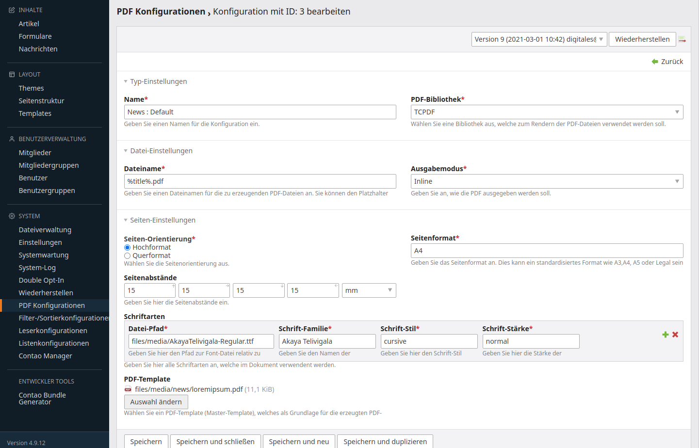
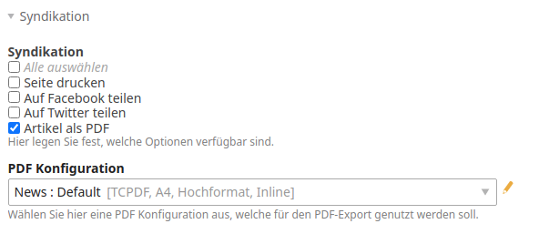

# Contao PDF Creator Bundle

This bundle add a generic way to configure the creation of pdf files, reuse this configurations and create pdfs on base of this configurations. It's based on [PDF Creator library](https://github.com/heimrichhannot/pdf-creator).

## Features
- add PDF configuration backend module
- can be easily used in your bundle
- bundled support for: 
    - contao article syndication
    - [Syndication Type Bundle](https://github.com/heimrichhannot/contao-syndication-type-bundle)
    
## Screenshot Configuration



## Usage

### Setup

1. Install the pdf library you want to use (currently mpdf and tcpdf are supported, see [PDF Creator library](https://github.com/heimrichhannot/pdf-creator)) for more information
1. Install bundle with composer or contao manager 
   
        composer require heimrichhannot/contao-pdf-creator-bundle
   
1. Update database
1. Create a pdf configuration in contao backend with system -> pdf configuration

### Export article as pdf

1. Set `huh_pdf_creator.enable_contao_article_pdf_syndication` to true

    ```yaml
    # config/config.yml or app/config/config.yml (Contao 4.4)
    huh_pdf_creator:
        enable_contao_article_pdf_syndication: true
    ```

1. Update database
1. Choose pdf as syndication option in article configuration and select a pdf configuration



### Syndication Bundle

Select PDF syndication and choose the pdf creator setting you want for export.

### Logging

To get enhanced debug information while creating pdfs, you can enter the contao dev mode. 
In dev mode, pdf creator bundle save all logs created by the pdf library (if the library supports PSR-3 logging) to a huh_pdf_creator-[DATE].log file.

## Developer

### Add pdf creator to your bundle

1. Use `PdfGenerator::generate()` to generator a pdf with your content. It expects an id of an PDF Creator config, html content and an `PdfContext` instance.
1. Use `DcaGenerator` to add an PDF Creator config field to your dca.

### Events

Event | Description
----- | -----------
BeforeCreateLibraryInstanceEvent | Passes the PDF Creator BeforeCreateLibraryInstanceCallback
BeforeOutputPdfCallbackEvent | Passes the PDF Creator BeforeOutputPdfCallback

## Configuration reference

```yaml
# Default configuration for extension with alias: "huh_pdf_creator"
huh_pdf_creator:

    # Set to true to use this bundle functionality in the contao article syndication.
    enable_contao_article_pdf_syndication: false

```